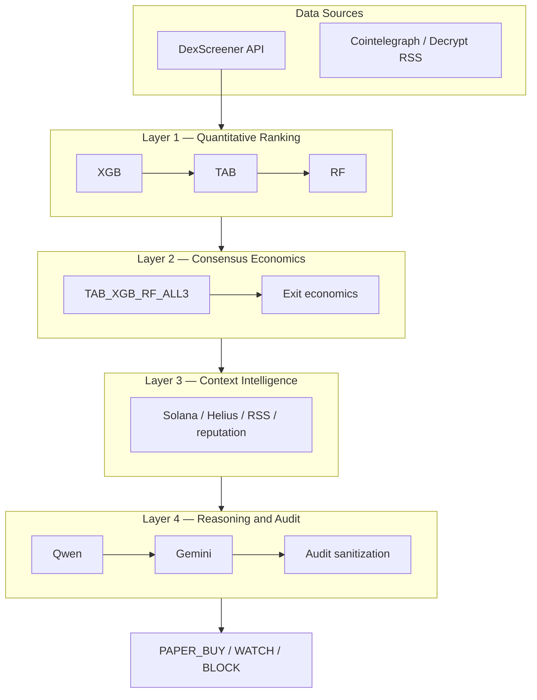

# 00 — System Overview

## Purpose

This document provides the top-level architecture for the MemeCoin AI Trader: data sources, four decision layers, storage touchpoints, and paper/demo outputs.

## Diagram

See [diagrams/system_overview.mmd](diagrams/system_overview.mmd).

Full diagram: `Data Sources → Feature Builder → XGB/TAB/RF → Consensus Tiers → Exit Economics → Context Intelligence → News/RSS Context → Qwen/Gemini → Decision → Audit/UI/Storage`.

## Current State

| Area | Today |
|------|-------|
| Entry point | `main.py` — FastAPI (`app/api.py`) + `watcher_loop()` (`app/live.py`) |
| Data ingestion | DexScreener trending (`app/dexscreener.py`); RSS archival (`app/analytics/sentiment.py`) |
| Models (runtime) | RF runtime inference (`app/observability/model_runtime_inference.py`); Tab offline lookup (`app/observability/model_lookup.py`) |
| Models (research) | XGB, TAB/TabICL, RF offline under `scripts/` and `data/training/` |
| Consensus | Tier labels used in Phase B/D scripts; **not** in live decision path |
| Context | RSS sentiment in scan loop; Solana/Helius parsers exist but limited live use |
| LLM | Gemini default for whale events; Ollama/Qwen optional (`app/llm_config.py`) |
| Execution | Paper trader (`app/execution/paper.py`); DEMO mode default; no real wallet |
| Storage | SQLite `data/trader.db`; CSV/JSONL side logs; Parquet research artifacts |

## Target State

A unified four-layer pipeline where:

1. **Layer 1** scores every candidate with XGB (broad), TAB (focused regimes), and RF (confirmation).
2. **Layer 2** assigns tiered consensus, applies exit economics, pair caps, and direct net-profit feasibility.
3. **Layer 3** enriches high-value candidates with Solana/Helius wallet intelligence and RSS sentiment — never as a standalone BUY signal.
4. **Layer 4** runs Qwen for memos and soft vetoes, Gemini selectively for audit, with sanitized structured audit reasons and full decision trace.

## Key Inputs

- DexScreener pair/market snapshots
- Manually verified research datasets (`CLEAN_MODEL_INPUT`)
- RF/TAB/XGB model artifacts and prediction parquets
- RSS feeds (Cointelegraph, Decrypt)
- Solana RPC and Helius enhanced transactions (enrichment)
- User settings (`data/settings.json`)

## Key Outputs

- `PAPER_BUY`, `WATCH`, `BLOCK` decisions
- SQLite audit tables (`pipeline_audit`, `gemini_decisions`, `paper_trades`, `sentiment_records`)
- JSONL decision traces (`data/audits/`)
- Research CSV/Parquet exports with manifests

## Consumers

- Background watcher (`app/live.py`)
- FastAPI UI (`static/index.html`, `static/system_config.js`)
- Offline research scripts (`scripts/phase_*`)
- Future artifact registry and UI lineage panel

## Open Questions

- When should XGB runtime inference be enabled relative to RF/Tab gates?
- How will tiered consensus map to existing economic gate thresholds?
- What is the minimum enrichment budget per scan for Helius credits?

## Non-Goals (Phase E0)

- Implementing any layer logic
- Changing scan frequency, trading modes, or model artifacts
- Wiring XGB or tiered consensus into live path
