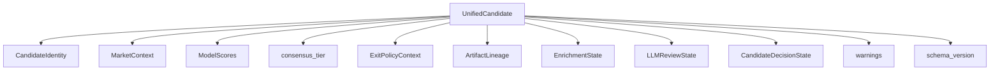
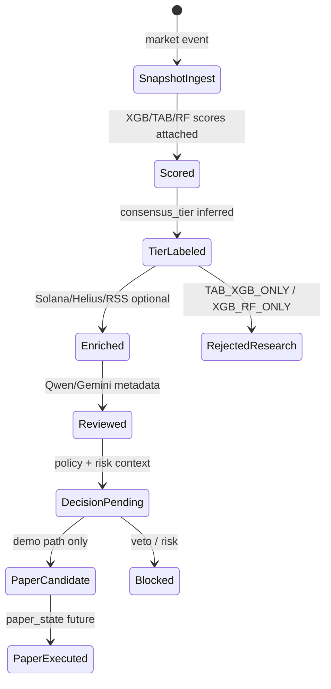

# 10 — Unified Candidate Schema (Phase E2)

## Purpose

Phase E2 introduces a **canonical Unified Candidate Schema** — a Pydantic v2 object model that can later connect market snapshots, model scores/ranks, consensus tiers, exit policy context, artifact lineage, enrichment status, LLM review metadata, and paper/demo decision state.

This phase is **schema and infrastructure only**. It does not change runtime behavior, trading logic, or live/demo paths.

## Why E2 Exists

Before E2, candidate-like data lived across SQLite tables, CSV exports, and ad hoc dicts with inconsistent field names and no shared validation. E2 establishes one strict schema so future phases can:

- Build direct-target datasets (E3) from one canonical object
- Register lineage against E1 artifact IDs
- Expose consistent fields to UI panels (E10/E11)
- Serialize deterministically to JSON, CSV, and Parquet

## Relationship to E0 / E1

| Phase | Contribution |
|-------|----------------|
| **E0** | Architecture docs defining four-layer Anchor Plan, consensus tiers, and data-lineage policy |
| **E1** | File-based `ArtifactRecord` registry, `content_hash` / `schema_hash`, path normalization |
| **E2** | `UnifiedCandidate` Pydantic schema composing identity, scores, tiers, lineage references, enrichment, LLM review, and decision placeholders |

E2 reuses E1 `sha256_hex` for deterministic `candidate_id` generation. It does **not** read or write the artifact registry during normal construction.

## Terminology

| Label | Meaning |
|-------|---------|
| **XGB** | XGBoost / XGBClassifier model artifacts, predictions, ranks, and scores |
| **RF** | Random Forest model artifacts, predictions, ranks, and scores |
| **TAB** | TabICL / TabICLv2 tabular model artifacts, predictions, ranks, and scores |

These labels are fixed by the Anchor Plan. E2 does not invent alternate meanings.

## Schema Diagram



## Candidate Lifecycle (Future)



E2 defines fields for each stage; it does **not** execute transitions.

## Field Groups

### CandidateIdentity

| Field | Notes |
|-------|-------|
| `candidate_id` | Deterministic SHA-256; see below |
| `pair_address`, `chain` | Required; pair normalized before hash |
| `event_timestamp` | Raw/received value preserved |
| `event_timestamp_normalized` | Always set at construction; used for hashing |
| `timestamp_precision` | `seconds` (default) or `milliseconds` |
| `source`, `source_artifact_id`, `source_row_id` | Provenance |
| `created_at` | UTC ISO-8601 |
| `coin_id`, `symbol`, … | Optional display fields |

### MarketContext

Optional numeric snapshot fields (`price`, `liquidity_usd`, `volume_24h`, …). `None` means missing — never coerced to zero. Non-finite values rejected unless `allow_nan_for_research=True` on validation helpers.

### ModelScores

| Field | Constraint |
|-------|------------|
| `score_xgb`, `score_tab`, `score_rf` | `[0, 1]` or `None`; not expected return |
| `rank_pct_*` | `[0, 1]` or `None` |
| `in_xgb`, `in_tab`, `in_rf` | `bool` or `None` |
| `vote_count` | Computed from `True` inclusion flags when omitted |

### Consensus Tier

`ConsensusTier` is a `StrEnum` for JSON/CSV compatibility.

### ExitPolicyContext

Stores exit simulation **metadata** only (horizon, TP/SL, fees, sim results). `round_trip_fee_pct` uses decimal fraction (`0.0308` = 3.08%). E2 does not run exit simulation.

### ArtifactLineage

References E1-style artifact IDs. Missing lineage → `lineage_warnings`, not fabricated IDs. Optional `is_syntactically_valid_artifact_id()` checks 64-char hex format.

### EnrichmentState / LLMReviewState / CandidateDecisionState

Schema-only placeholders for context intelligence and audit layers. No network or LLM calls in E2.

## Deterministic candidate_id Rules

```text
candidate_id = sha256("candidate:v1|" + chain + "|" + normalized_pair + "|"
                      + event_timestamp_normalized + "|" + source
                      + ["|" + source_row_id if present])
```

- Uses **normalized** pair address and **normalized** timestamp only
- Stable SHA-256 hex (not random UUID)
- `coin_id` not required (historical artifacts may lack it)

## Timestamp Normalization

`normalize_event_timestamp(value, precision="seconds")` → ISO-8601 UTC string ending in `Z`.

| Input | Behavior |
|-------|----------|
| Naive `datetime` | Assumed UTC |
| Timezone-aware `datetime` | Converted to UTC |
| ISO string with offset | Converted to UTC |
| Unix seconds | Accepted |
| Unix milliseconds | Accepted (values ≥ 1e12) |
| Default precision | Seconds (microseconds zeroed) |

Equivalent inputs must produce the same `event_timestamp_normalized` and therefore the same `candidate_id`.

## Consensus Tier Mapping

| in_tab | in_xgb | in_rf | Tier | Anchor Plan |
|--------|--------|-------|------|-------------|
| T | T | T | `TAB_XGB_RF_ALL3` | **Tier 1** |
| T | F | T | `TAB_RF_ONLY` | **Tier 2** |
| T | T | F | `TAB_XGB_ONLY` | Research-only / rejected |
| F | T | T | `XGB_RF_ONLY` | Research-only / rejected |
| T only | | | `TAB_ONLY` | Label only |
| XGB only | | | `XGB_ONLY` | Label only |
| RF only | | | `RF_ONLY` | Label only |
| none true | | | `NONE` | No votes |
| any `None` (strict) | | | `UNKNOWN` | Ambiguous |

`infer_consensus_tier(..., strict=False)` treats `None` as `False` (documented and tested).

E2 **labels** tiers only; it does not implement trading decisions.

## StrEnum Serialization Policy

All status and tier enums inherit `StrEnum`. JSON and flat exports use `.value` strings directly — no custom encoders required.

## Pydantic v2 Validation Policy

- `ConfigDict(extra="forbid")` on all schema models
- `Field(ge=0, le=1)` for scores and rank percentiles
- `model_validator(mode="before")` for cross-field logic (`candidate_id`, `vote_count`, `consensus_tier`)
- `strict_consensus` context flag on `UnifiedCandidate.model_validate` / `from_dict`

## None / NaN Serialization Policy

| Representation | Internal | Parquet export | CSV export |
|----------------|----------|----------------|------------|
| Missing | `None` | `None` | `""` |
| pandas NaN on import | → `None` | — | — |
| Research NaN | Only with `allow_nan_for_research=True` | — | — |

Flat serialization is deterministic across repeated calls. NaN must not leak into content-hash-sensitive outputs unintentionally.

## Storage Policy

- **Schema first** — canonical `UnifiedCandidate` object is the source of truth
- **No SQLite write yet** — `trader.db` unchanged
- **No CSV/SQLite dual-generation yet**
- Future canonical builder (E3+) writes artifacts from one candidate object, then registers in E1

## Package Layout

```text
app/candidates/
  __init__.py
  schema.py          # Pydantic models, infer_consensus_tier, compute_candidate_id
  validation.py      # Timestamps, numerics, artifact id syntax
  serialization.py   # dict/json/flat round-trips
  examples.py        # Offline example builders
```

Tests: `tests/test_candidate_schema.py`

## Explicit Non-Goals (E2)

- Runtime integration, UI changes, paper execution
- SQLite schema changes or `trader.db` writes
- Modifying existing CSV/Parquet/model artifacts
- Model retraining (RF/TAB/XGB)
- Solana / Helius / RSS / Qwen / Gemini calls
- New Decision Gate or production trading gates
- Exit simulation computation

## How E2 Supports E3 (Direct Target Construction)

E3 dataset builders can populate `UnifiedCandidate` rows from V5 selected trades and CLEAN_MODEL_INPUT, attach `ArtifactLineage.source_artifact_id`, export flat Parquet with stable columns, and register outputs in E1 — all from one schema.

## How E2 Supports Future UI Integration

UI panels can bind to nested sections (`market`, `model_scores`, `consensus_tier`, `enrichment`, `llm_review`, `decision`) and flat exports for tables without ad hoc field mapping.

## Anchor Plan Compliance

E2 does **not** challenge the Anchor Plan:

1. Quantitative ranking: XGB / TAB / RF fields preserved
2. Consensus economics: Tier 1 / Tier 2 / research-only labels match audited decomposition
3. Context intelligence: enrichment placeholders only
4. Reasoning & audit: LLM review placeholders only

No new gates, no trading behavior changes.
